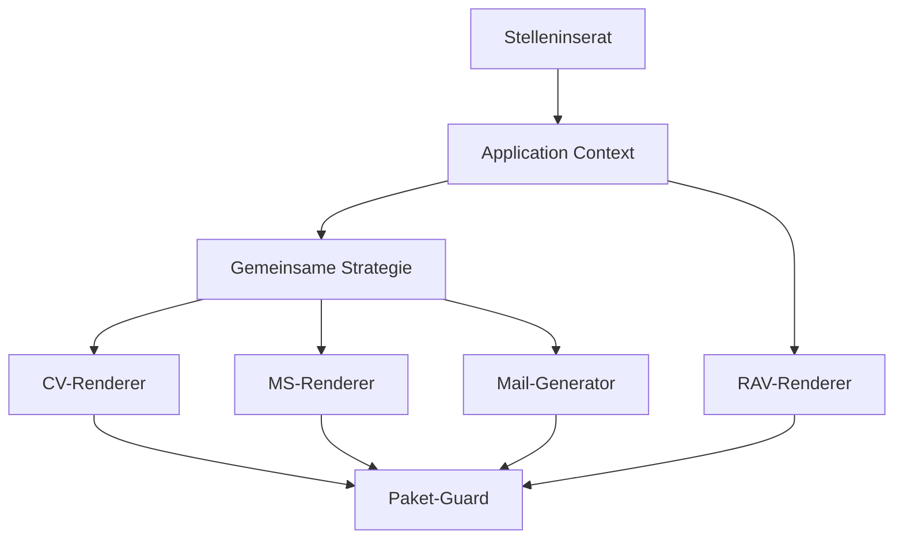

# CV Autopilot

CV Autopilot erzeugt aus einem Stelleninserat ein konsistentes Bewerbungspaket für Adam Dolinsky. Eine gemeinsame Bewerbungsinstanz steuert CV, Motivationsschreiben, Mailentwurf und RAV-Recap. Gestaltung und Renderer bleiben fix; pro Bewerbung ändern sich nur analysierte Daten, Strategie und strukturierte Texte.

## Ergebnis pro Bewerbung

```text
applications/<applicationId>/
├── 00_stelleninserat.md
├── 01_application-context.json
├── 02_cv_<variant>.pdf
├── 03_cv_<variant>-preview.html
├── 04_manifest.json
├── 05_render-report.json
├── 06_application-strategy.json
├── 07_motivationsschreiben.pdf
├── 08_motivationsschreiben-preview.html
├── 09_motivationsschreiben-report.json
├── 10_mailanschreiben.md
├── 11_application-package-report.json
├── 12_rav-recap.html
├── 13_rav-recap.json
├── 14_rav-recap.txt
└── 15_rav-recap-report.json
```

Zusätzlich entsteht unter `exports/` ein deterministisches `tar.gz`-Archiv mit SHA-256-Sidecar.

## Installation

Benötigt Node.js 22 und Chromium für Playwright. Die Installation erfolgt einmal pro Umgebung, nicht pro Bewerbung.

```bash
npm ci --no-audit --no-fund
npx playwright install --with-deps chromium
```

## Vollständige Bewerbung erzeugen

```bash
npm run create:application -- \
  --job-ad fixtures/job-ad.txt \
  --extracted-context fixtures/application-context.json \
  --package-input fixtures/package-input.json \
  --source-url "https://example.ch/jobs/123" \
  --application-date 2026-07-23
```

`--extracted-context` und `--package-input` sind die strukturierten Übergabepunkte für ChatGPT beziehungsweise die spätere Web-App:

- `--extracted-context` enthält Inseratsfakten, Anforderungen, Kontakte, Pensum, Eintritt und Quellenstatus.
- `--package-input` enthält Strategie-Overrides, geprüfte MS-Inhalte und optional vollständig recherchierte RAV-Daten.

Ohne `--package-input` erstellt das System einen sicheren, beleggestützten Entwurf. Best-Effort- und Pflichtfeld-Ersatzwerte werden im RAV-Report markiert und müssen vor der Übertragung geprüft werden.

## Eine Analyse – vier Ausgaben



Kein Modul führt eine zweite, abweichende Stellenanalyse durch. Arbeitgeber, Stellenbezeichnung, Kontaktperson, Belege und Bewerbungs-ID werden paketweit abgeglichen.

## Fixe und dynamische Bestandteile

| Fix und hash-gesperrt | Pro Bewerbung dynamisch |
|---|---|
| CV-/MS-Templates | Stellen- und Arbeitgeberanalyse |
| CSS, Typografie, Geometrie | CV-Variante und Textprioritäten |
| Hintergrund, Logo und Icons | Bewerbungsstrategie |
| RAV-HTML-Framework | MS-Inhalt und Hervorhebungen |
| Render- und Qualitätsregeln | Mailtext und RAV-Werte |

`layout-lock.json` enthält die SHA-256-Hashes aller kanonischen Layoutdateien. Jeder Produktionslauf führt automatisch `npm run verify:layout` aus. Eine normale Bewerbung bricht sofort ab, wenn CSS, Template, Logo, Hintergrund oder Icons vom freigegebenen Stand abweichen.

Die Sperre wird nur nach einer ausdrücklich beauftragten und visuell freigegebenen Layoutänderung aktualisiert:

```bash
node scripts/verify-layout-lock.mjs --write
```

## CV

Der bestehende Playwright-Renderer erzeugt einen ATS-lesbaren, zweiseitigen CV aus:

- `data/private/cv.master.json`
- `data/public/variants/*.json`
- `src/templates/cv.ts`
- `src/styles/tokens.css`
- `src/styles/cv.css`

Verfügbare Varianten:

- `general`
- `communication-content`
- `administration-gever`
- `cms-web-process`

Ein Bewerbungslauf rendert ausschliesslich die ausgewählte Variante. `render:all` ist ein Entwicklungs- und CI-Test, kein Bestandteil eines normalen Live-Runs.

## Motivationsschreiben

Der MS-Generator trennt Inhalt und Gestaltung strikt:

- Das Sprachmodell beziehungsweise die Web-App liefert strukturierte Absätze, Beleg-IDs und Hervorhebungen.
- Der Renderer bestimmt A4-Geometrie, Hintergrund, Rahmen, Logo, Typografie, Datum, Referenz und Signatur.
- Die Referenz erscheint nur nach sicherer Erkennung.
- Der Textblock wächst von unten nach oben; Schriftverkleinerung und Abschneiden sind verboten.
- Der Bericht prüft eine Seite, ATS-Text, Datumsausrichtung, Body-Start, Hervorhebungsbudget, Überläufe und Kollisionen.

Verbindliche Quellen:

- `modules/motivation-letter/APPROVED_GOLDEN_STANDARD.md`
- `modules/motivation-letter/layout-reference.json`
- `modules/motivation-letter/styles/motivation-letter.css`
- `modules/motivation-letter/references/ad_logo.png`

## Mail

`10_mailanschreiben.md` bleibt ein kurzer Entwurf mit Frontmatter:

- Betreff und Stellenbezeichnung entsprechen dem MS.
- Status ist immer `draft`.
- Es erfolgt kein automatischer Versand.
- Nicht explizit belegte Empfängeradressen werden als Review-Vorschlag markiert.

## RAV-Recap

Der RAV-Renderer erzeugt aus denselben Daten:

- mobile Offline-HTML mit einer Copy-Box pro Job-Room-Feld,
- JSON als maschinenlesbare Quelle,
- TXT als Fallback,
- Report mit Quellen, Annahmen und Qualitäts-Gates.

Das freigegebene Framework liegt in `modules/rav-recap/mobile-template.html`. Die spätere Web-App verwendet dieselbe Vorlage und keinen zweiten UI-Entwurf.

## Qualität und Tests

Schnelle Daten- und Paketprüfungen:

```bash
npm run build
npm run validate
npm run verify:layout
npm run test:data
npm run test:application
npm run test:application-package
npm run test:rav-recap
```

Vollständige Renderprüfung vor Änderungen am Generator oder Layout:

```bash
npm run render:all
npm run test:render
npm run render:motivation-letter -- \
  --input modules/motivation-letter/tests/fixtures/admin-sachbearbeiter-fk-letter.json \
  --output-id admin-sachbearbeiter-fk
npm run render:motivation-letter -- \
  --input modules/motivation-letter/tests/fixtures/transgourmet-letter.json \
  --output-id transgourmet-digital-marketing
npm run test:motivation-letter
```

GitHub Actions führt diese vollständige Suite bei Pull Requests und manuellen Workflow-Läufen aus. Normale Bewerbungen starten keine Vier-Varianten-Suite und installieren keine Abhängigkeiten neu.

## Sicherheit und Freigabe

- Niemals Passwörter, Tokens, private Schlüssel oder Session-Cookies speichern.
- Reale Bewerbungspakete unter `applications/` bleiben git-ignoriert.
- Keine unbelegten Kenntnisse oder Arbeitgeberangaben verwenden.
- Kein automatischer Versand oder automatische Portalübermittlung.
- Das finale Paket bleibt bis zu Adams manueller Schlusskontrolle im Status `draft`.

## Historischer Stand

Der vollständige Zustand vor dieser Konsolidierung ist auf `archive/pre-cleanup-2026-07-22` gesichert. Alte Branches und Pull Requests sind historische Referenzen; sie dürfen nicht als Produktionsbasis verwendet werden.
